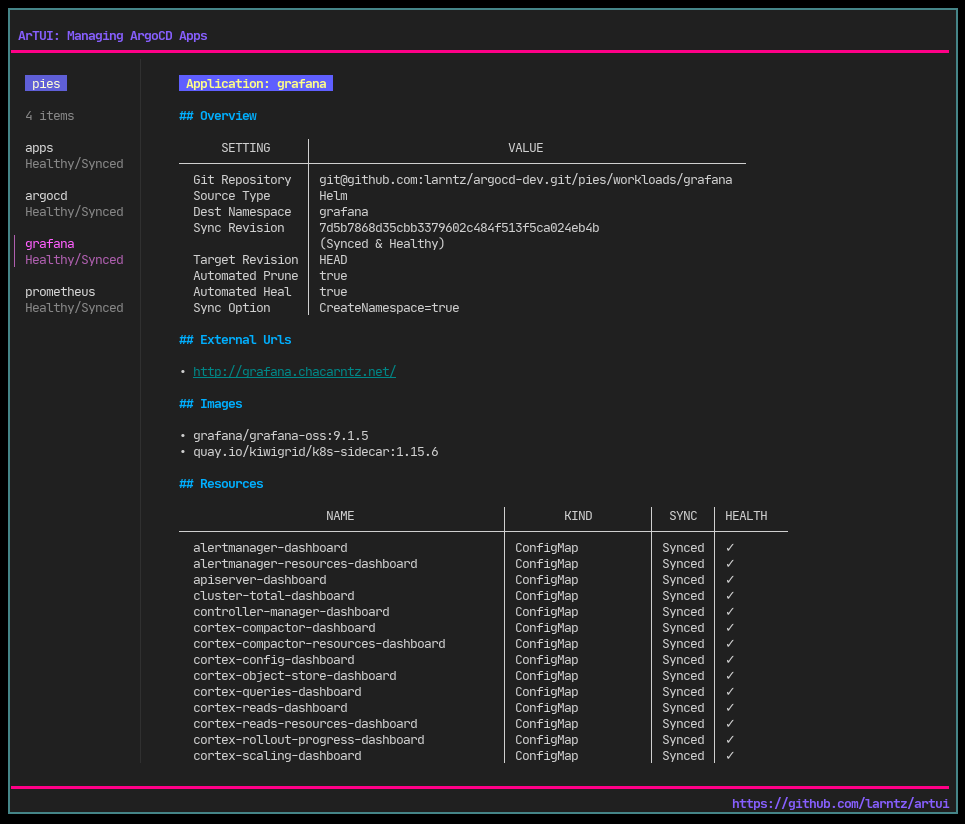

= ArTUI

This is a TUI app for interacting with ArgoCD and managing apps. It's in very early stages and basically just a toy project that I may someday spend more time finishing...

== Commands

- `:r` refresh app
- `:hr` hard refresh app
- `:s` sync app
- `:q` quit

== Navigation

- `j`,`k` up/down application list
- up arrow, down arrow scroll application overview
- `/` search application list

== Compatility

This is currently being developed against ArogCD version 2.4.x. 

== Dependencies

To setup dependencies use the replace() block from the https://github.com/argoproj/argo-cd/blob/master/go.mod[argocd project `go.mod`] file. Then run `go mod tidy -compat=1.1.7`.
